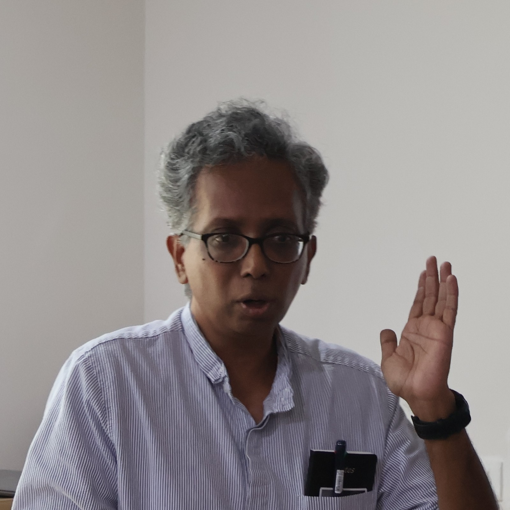

::: {.about-profile}
::: {.about-portrait}
{fig-alt="Arvind Ramanathan, Professor at inStem and principal investigator of the Ramanathan Lab"}
:::

::: {.about-copy}
::: {.eyebrow}
Arvind Ramanathan
:::

I am a Professor at the Institute for Stem Cell Science and Regenerative Medicine (inStem) in
Bangalore, where I lead a laboratory studying how metabolism shapes the capacity of human muscle to
repair, adapt and remain resilient with age. I trained as a chemist at New York University and in
chemical biology in Stuart Schreiber's laboratory at the Broad Institute of Harvard and MIT, before
developing a metabolomics programme at the Buck Institute for Research on Aging. Since moving my
laboratory to inStem in 2019, I have brought together mass-spectrometry metabolomics and lipidomics,
bioengineered human muscle models, and experiments in microgravity and cold. By comparing environments
that damage muscle with responses that protect it, we aim to uncover mechanisms that preserve muscle
function and translate them toward healthier aging.

[Publications →](publications.qmd){.text-link}
[Google Scholar →](https://scholar.google.com/citations?user=cK3W34QAAAAJ&hl=en){.text-link}
[\@arvindaginglab →](https://x.com/arvindaginglab){.text-link}
:::
:::
