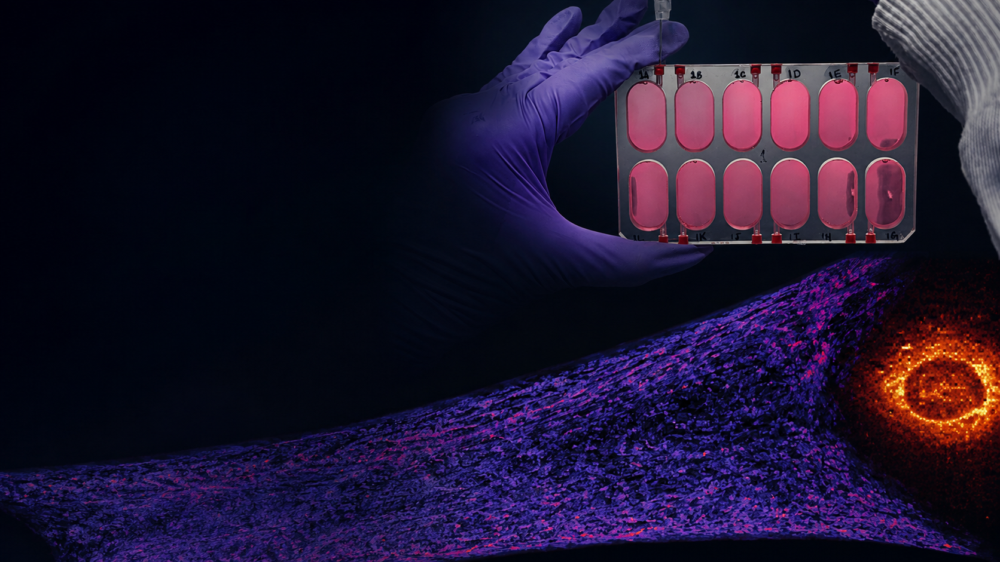
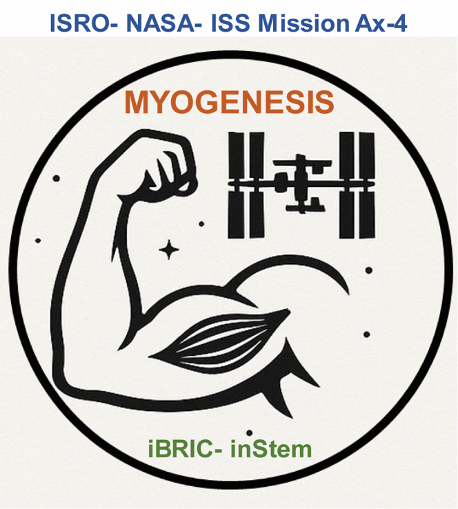
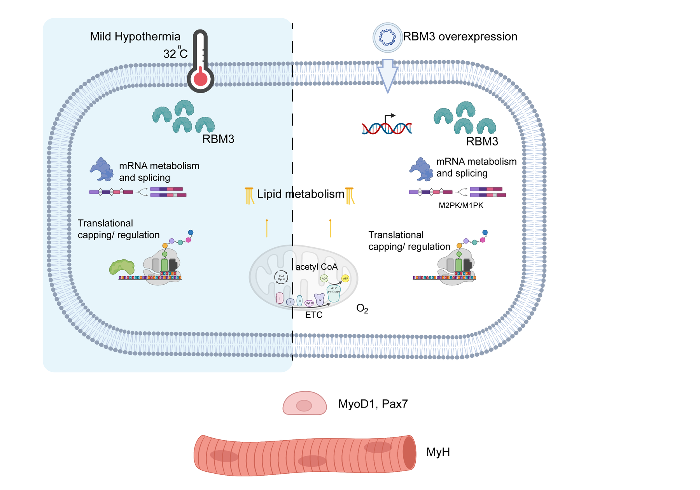

::: {.hero-container}
::: {.hero-image}

::: {.hero-text}
::: {.hero-eyebrow}
Ramanathan Lab · inStem, Bangalore
:::
# Healthy aging depends on how well muscle maintains and rebuilds itself.

::: {.hero-byline}
We work out what preserves that capacity — in aging, in microgravity and in the cold — and we are
developing interventions to improve muscle strength and resilience.
:::

:::
:::
:::

::: {.content-block}

We use environmental extremes — from microgravity to cold — to reveal how metabolism governs tissue
loss and resilience. One stress degrades the tissue and one protects it. Both act through the
mitochondrion, which is why the comparison is worth making.

[Explore the research →](research.qmd){.text-link} [Browse publications →](publications.qmd){.text-link}

:::

::: {.feature}
::: {.feature-image .feature-image--scientific}
{fig-alt="A whole bioengineered human muscle construct imaged with TMRM, showing mitochondrial membrane potential across the tissue"}
:::
::: {.feature-body}
## Bioengineered human muscle

Bioengineered human muscle lets us measure what cells are doing metabolically and then ask what the whole tissue can do. We are
extending the platform to motor neuron–muscle co-cultures, contractile force measurements and
multiplexed models of sarcopenia.

[Human tissue models →](research/tissue-models.qmd)
:::
:::

::: {.feature}
::: {.feature-body}
## Metabolism shapes repair

How metabolic state and the lipid signals sent by senescent cells influence whether muscle stem cells
rebuild tissue or lose function with age. The work runs from fundamental mechanism through to current sarcopenia therapeutics.

[Muscle regeneration and aging →](research/metabolism.qmd)
:::
::: {.feature-image}
{fig-alt="Densely packed, aligned human myotubes stained for myosin heavy chain in red with nuclei counterstained blue"}
:::
:::

::: {.feature .feature-dark}
::: {.feature-image .feature-image--scientific}
{fig-alt="Project Myogenesis logo for the ISRO–NASA Axiom Mission 4 experiment aboard the International Space Station"}
:::
::: {.feature-body}
## Project Myogenesis aboard Axiom Mission 4

Our human muscle stem-cell experiment was flown to the International Space Station as part of
Axiom Mission 4. Cultures were maintained in orbit with matched ground controls at inStem; molecular
and metabolic analyses are underway. The mission asks what rapid muscle loss in orbit can tell us about repair, disuse and aging on Earth.

[Explore Project Myogenesis →](projects/project-myogenesis-iss.qmd) · [Nature India coverage →](https://www.nature.com/articles/d44151-025-00072-8)
:::
:::

::: {.feature}
::: {.feature-body}
## Cold makes cells more capable

Mild cooling is not simply an injury. It switches on a conserved programme — RBM3 among its mediators —
that reorganises mitochondrial metabolism and RNA regulation and leaves cells better able to withstand
stress. We are working out how that programme runs, and whether it can be engaged without the cold.

[Cold and cellular resilience →](research/cold.qmd)
:::
::: {.feature-image .feature-image--scientific}
{fig-alt="Graphical abstract summarising the cellular effects of mild hypothermia and RBM3 on RNA, lipid metabolism, mitochondria and muscle differentiation"}
:::
:::

::: {.translation-band}
::: {.translation-inner}
::: {.translation-eyebrow}
From mechanism to intervention
:::

## Understanding why muscle fails is only half of the problem

The mechanisms we identify — metabolic, lipid-signalling, cold-responsive — are also starting points
for intervention. We test candidates in the same bioengineered human tissue we use to study the
biology, measuring strength, fatigue resistance and metabolic state, and we read those results
against cohort measurements that show which changes matter in people.

::: {.translation-note}
Several of these interventions are the subject of intellectual-property protection and are described
here only in general terms.
:::

[Sarcopenia and precision medicine →](projects/sarcopenia-translation.qmd){.text-link} [Lipid signalling as a therapeutic target →](projects/ptgds-inhibitors.qmd){.text-link}
:::
:::

::: {.content-block}

## Recent publications

::: {#listing-recent}
:::

[All publications →](publications.qmd)

:::
