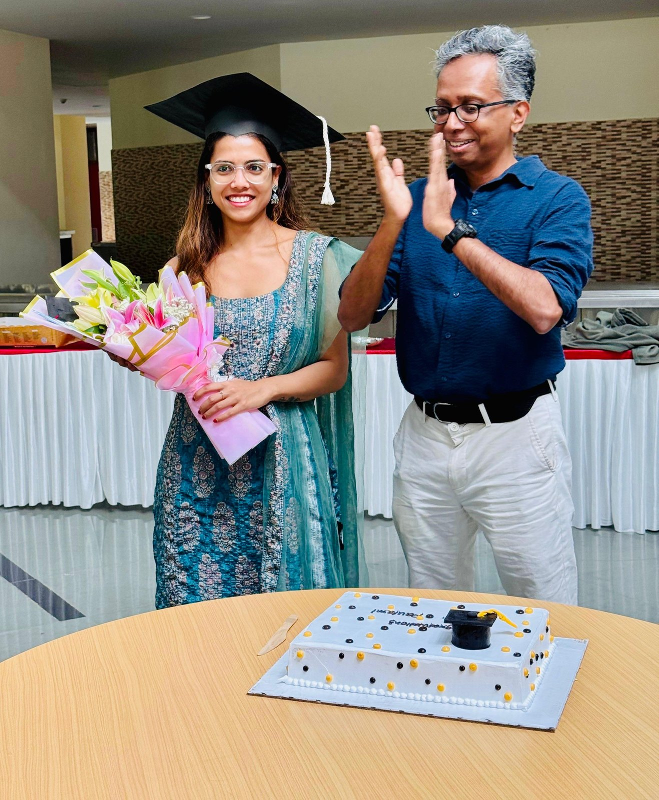
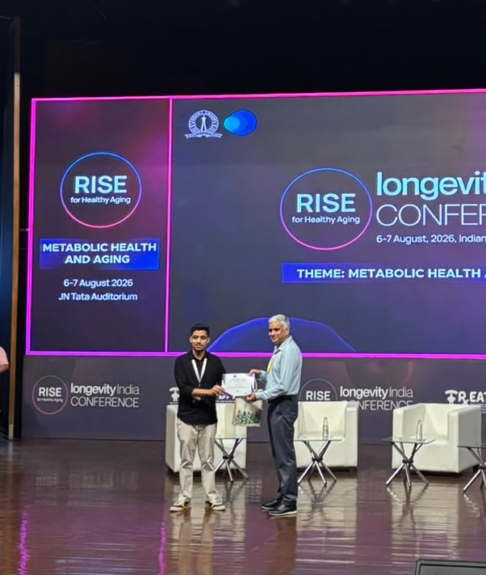
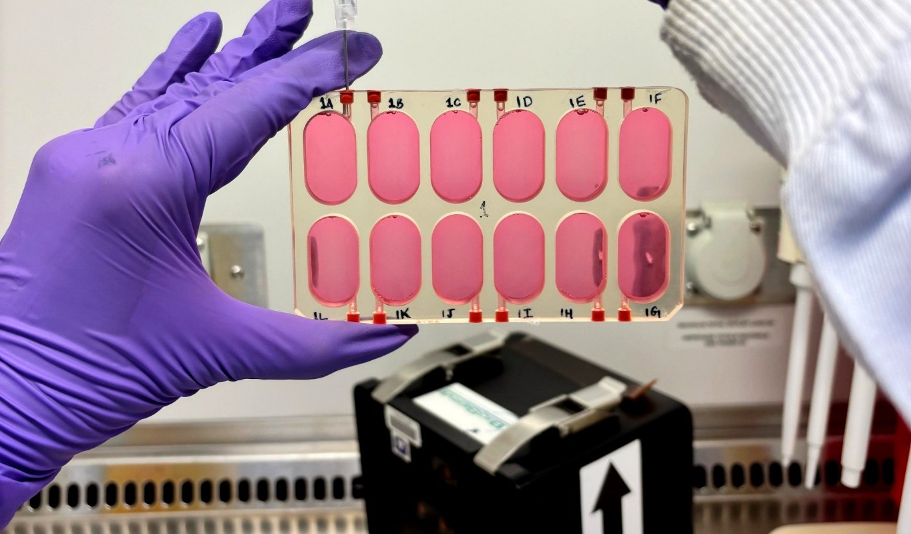
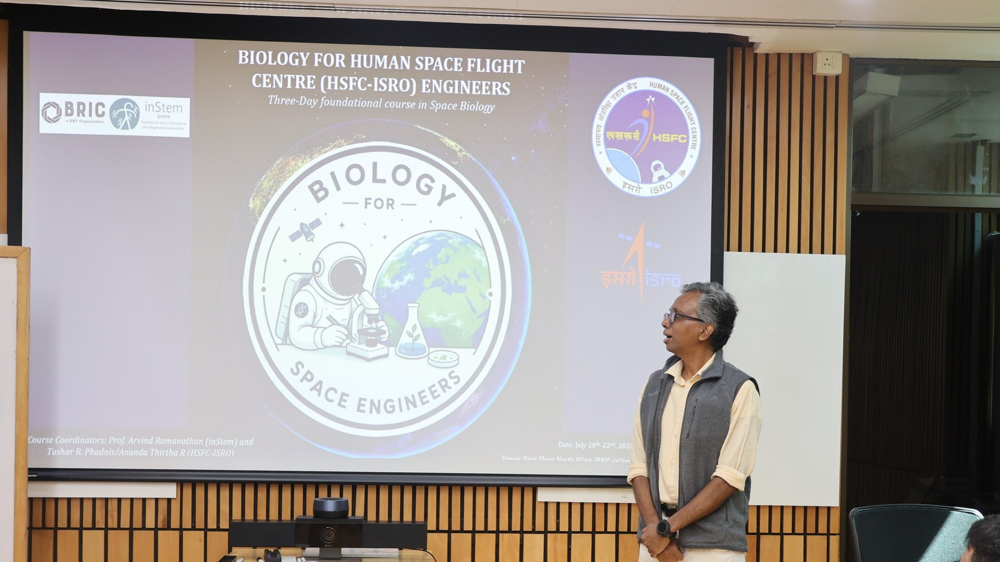

::: {.news-feature}
::: {.news-feature-image .news-feature-image--photo}
{fig-alt="Paulami Dey in her graduation cap holding flowers, with Arvind Ramanathan applauding beside her and a congratulations cake on the table"}
:::

::: {.news-feature-copy}
::: {.news-date}
Congratulations · 11 September 2026
:::

## Dr Paulami Dey

Paulami Dey successfully defended her PhD thesis on 11 September 2026.

Her work asked how mammalian cells sense and adapt to mild cold, and identified the cold-shock protein
RBM3 as a mediator that strengthens mitochondrial metabolism and muscle-cell differentiation. Two
papers in *Communications Biology* came out of it, and they are the foundation our
cold-resilience programme is built on.

For years she has been quietly persuading cells to keep their cool. It is now the rest of the lab's
turn to celebrate.

[Cold-shock proteome and RBM3 →](pubs/2024-cold-shock-proteome-of-myoblasts-reveals-role-of-rbm3-in-pro.qmd){.text-link} [Molecular mediators of cold adaptation →](pubs/2025-molecular-mediators-of-cold-adaptation-in-mammalian-cells.qmd){.text-link}
:::
:::

::: {.news-feature}
::: {.news-feature-image .news-feature-image--photo}
{fig-alt="Heera Lal receiving the Best Poster Award certificate from Professor Deepak Saini on stage at the RISE Longevity India Conference"}
:::

::: {.news-feature-copy}
::: {.news-date}
Award · August 2026
:::

## Heera Lal wins Best Poster at Longevity India

Heera Lal received the Best Poster Award in the Metabolic Health and Aging theme at the RISE
Longevity India Conference, held at the Indian Institute of Science on 6–7 August 2026. The award was
presented by Professor Deepak Saini of IISc.

The conference theme was the lab's own subject, which makes the award a useful reading of where the
work stands among the people who do it.
:::
:::

::: {.news-feature}
::: {.news-feature-image .news-feature-image--photo}
{fig-alt="Loading human muscle stem cells into flight hardware before Axiom Mission 4"}
:::

::: {.news-feature-copy}
::: {.news-date}
Mission · 2025
:::

## Project Myogenesis reaches the International Space Station

Our human muscle stem-cell experiment flew aboard Axiom Mission 4 and was cultured on the
International Space Station by astronaut Shubhanshu Shukla. Matched ground controls were maintained at
inStem, and post-flight molecular and metabolic analyses are underway.

[Explore Project Myogenesis →](projects/project-myogenesis-iss.qmd) · [Read the Nature India coverage →](https://www.nature.com/articles/d44151-025-00072-8)
:::
:::

::: {.news-feature}
::: {.news-feature-image .news-feature-image--photo}
{fig-alt="Biology for Human Spaceflight Engineers course at inStem"}
:::

::: {.news-feature-copy}
::: {.news-date}
Teaching · July 2026
:::

## Biology for Human Spaceflight Engineers

Arvind Ramanathan taught *Biology for Human Spaceflight Engineers* at inStem for engineers from ISRO's
Human Space Flight Centre, 20–22 July 2026.
:::
:::

::: {.news-list}
::: {.news-item}
::: {.news-date}
2026 · Publication
:::

## A human muscle model moves from platform to experiment

A study in *ACS Biomaterials Science & Engineering* uses bioengineered human skeletal muscle to examine
how a metabolic intervention influences tissue development. The study anchors our human tissue-model programme, pairing tissue-scale imaging with metabolic measurement.

[Read the paper record →](pubs/2026-dose-dependent-effects-of-dihydronicotinamide-riboside-on-hu.qmd)
:::

::: {.news-item}
::: {.news-date}
2026 · Publication
:::

## Mapping sarcopenia in an Indian pilot cohort

With our clinical collaborators we reported an integrative analysis of plasma small-molecule and
gut-microbiome markers of sarcopenia in *Scientific Reports*.

[Read the paper record →](pubs/2026-integrative-analysis-of-plasma-small-molecule-and-gut-microb.qmd)
:::

::: {.news-item}
::: {.news-date}
2025 · Publication
:::

## Molecular mediators of cold adaptation

A review in *Communications Biology* brings together the molecular mechanisms through which mammalian
cells sense and adapt to cold.

[Read the paper record →](pubs/2025-molecular-mediators-of-cold-adaptation-in-mammalian-cells.qmd)
:::

::: {.news-item}
::: {.news-date}
2024 · Publication
:::

## RBM3 links cold adaptation to muscle-cell metabolism

Our proteomics study identified RBM3 as a mediator of enhanced mitochondrial metabolism and
myoblast differentiation during mild hypothermia.

[Read the paper record →](pubs/2024-cold-shock-proteome-of-myoblasts-reveals-role-of-rbm3-in-pro.qmd)
:::
:::
