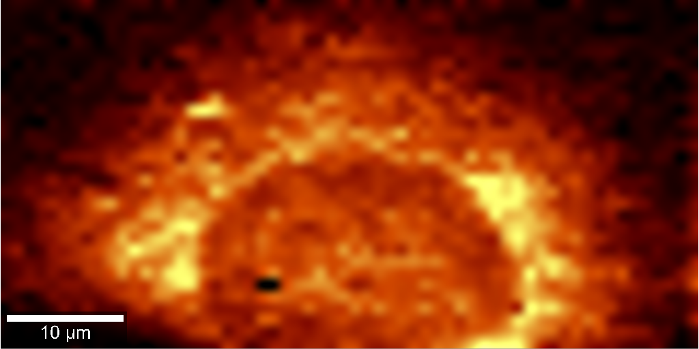

::: {.platform-lead}
Our platforms let us follow a mechanism from the behaviour of single cells up to what a whole tissue can do. The same question can then be put to human tissue models, to cells under controlled environmental stress, and to quantitative functional and molecular measurement.
:::

::: {.platform-feature}
::: {.platform-image .platform-image--scientific}
{fig-alt="A whole bioengineered human muscle construct imaged with TMRM, showing mitochondrial membrane potential across the tissue"}
:::
::: {.platform-copy}
## Bioengineered human muscle

Bioengineered human muscle provides a controlled tissue-scale system for investigating development,
injury, repair and treatment response. The platform is being extended to motor neuron–muscle
co-cultures and multiplexed models of sarcopenia.

We measure contractile force alongside quantitative imaging and molecular profiling, so that tissue architecture and metabolic state can be read against performance.

[Explore the tissue-model work →](research/tissue-models.qmd)
:::
:::

::: {.platform-feature .platform-feature--dark}
::: {.platform-copy}
## Gravisim

Gravisim is our ground-based microgravity simulation platform. It enables questions arising
from spaceflight to be investigated through controlled, repeatable experiments with cells and
bioengineered tissues. A patent has been filed for the Gravisim microgravity system.

[See the microgravity programme →](research/space.qmd)
:::
::: {.platform-animation}
<iframe src="assets/clinostat-animation-cells.html"
        title="Interactive animation showing adherent cells rotating about two axes in a clinostat"
        loading="lazy"
        sandbox="allow-scripts"></iframe>
:::
:::

::: {.platform-grid}
::: {.platform-card}
## Metabolomics and lipidomics

Discovery and targeted measurements across cells, tissues and biofluids show how metabolic state tracks with cell fate, environmental stress and treatment response.

[View the platform record →](projects/metabolomics-platform.qmd)
:::

::: {.platform-card .platform-card--image}
{fig-alt="Raman chemical map of a single cell showing the spatial distribution of molecular signals"}

## Raman imaging and image analysis

Label-free Raman maps and quantitative microscopy reveal spatial changes that bulk measurements can
miss.

[View the Raman work →](projects/raman-imaging.qmd)
:::
:::

*Raman map from Pundlik SS, Venkateshvaran A, Suresh Y, Mamgain H, Ramanathan A. ACS Omega 2026;11(9):14426.*
