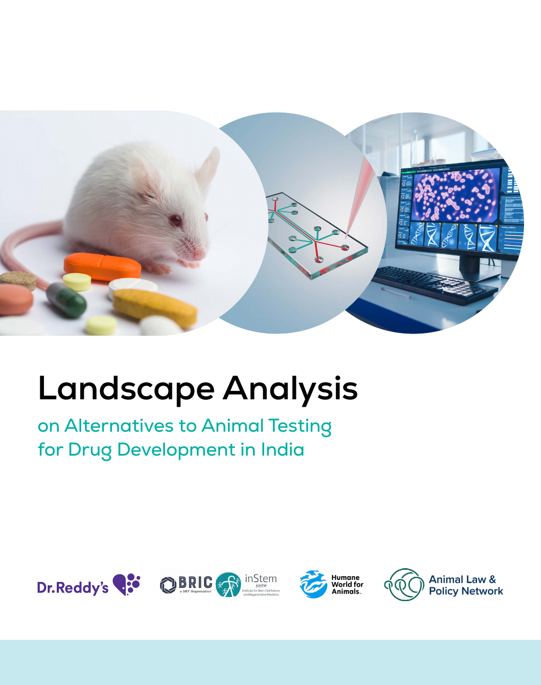

::: {.columns .publication-report-entry}
::: {.column width="28%"}
{fig-alt="Cover of the Landscape Analysis on Alternatives to Animal Testing for Drug Development in India"}
:::

::: {.column width="72%"}
K V S Narayana Raju, Surat Parvatam, Harshita Mittal, Paulami Dey, Arvind Ramanathan, Apoorva, Vaishnavi Vasanth, Anita Varadharajan. *Landscape Analysis Report 2025–26*. Dr. Reddy’s Laboratories Limited; DBT BRiC–Institute for Stem Cell Science and Regenerative Medicine (inStem); Humane World for Animals India; Animal Law & Policy Network.

The report examines the use and regulatory adoption of new approach methodologies in India and sets out a roadmap for coordination, validation, infrastructure, training and regulatory alignment.

<a class="btn btn-primary" href="https://www.drreddys.com/cms/sites/default/files/2026-02/Final%20report%20-%20Landscape%20Analysis%20on%20alternatives%20to%20animal%20testing_report.pdf">Download the report (PDF)</a>
:::
:::
