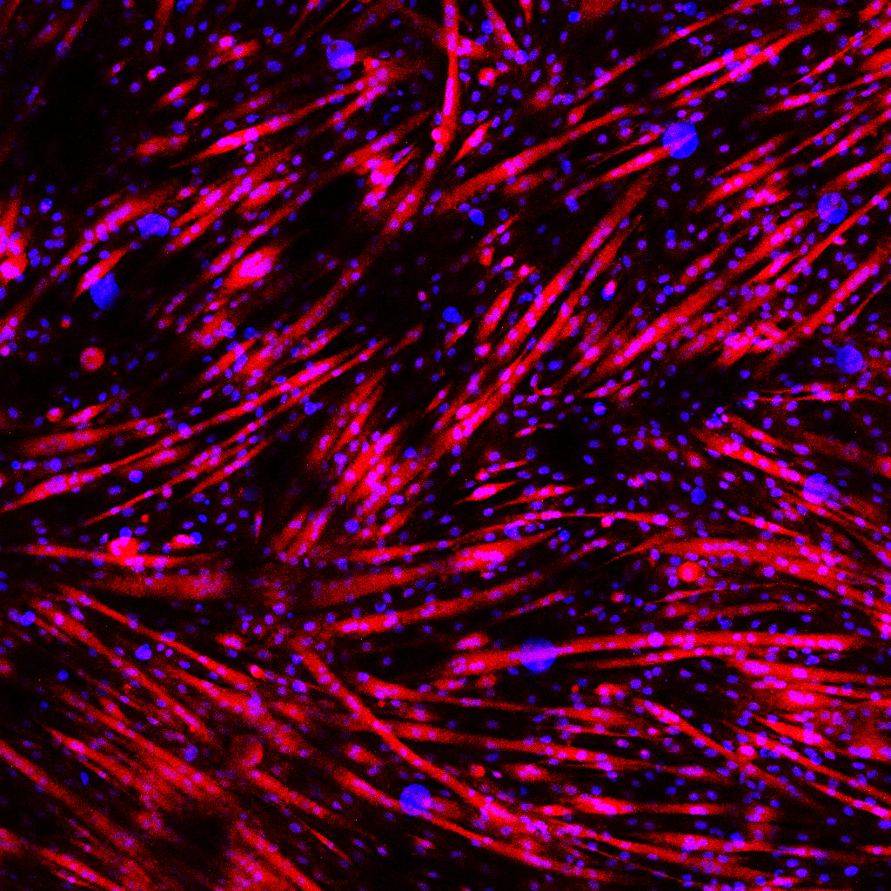

::: {.area-page-hero}
::: {.area-page-copy}
We ask why muscle can rebuild after injury in one metabolic state yet fail in another. The current programme follows muscle stem-cell behaviour, the signals produced by senescent cells, and the mechanisms among them that could be translated into therapies for sarcopenia.
:::
::: {.area-page-image}
{fig-alt="Differentiated human myoblasts stained for myosin heavy chain, with aligned myotubes in red and nuclei in blue"}
:::
:::

*Differentiated human myoblasts stained for myosin heavy chain (MyH). Lab image.*

## Current directions

::: {#area-projects}
:::

## Publications from this area

::: {#area-publications}
:::
