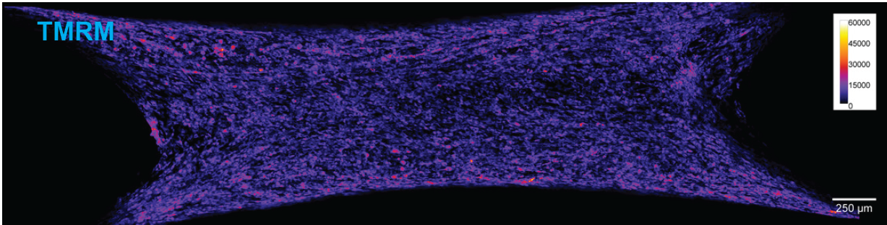

::: {.area-page-hero}
::: {.area-page-copy}
We use bioengineered human muscle and neuromuscular systems to follow cellular state through to tissue function. These models allow aging, sarcopenia and treatment response to be studied in a controlled
human context while functional, imaging and molecular measurements are made on the same tissue.
:::
::: {.area-page-image .area-page-image--scientific}
{fig-alt="A whole bioengineered human muscle construct imaged with TMRM, showing mitochondrial membrane potential across the tissue"}
:::
:::

*Mitochondrial membrane potential across a bioengineered human muscle construct. Lab image.*

## Current directions

::: {.direction-grid}
::: {.direction-card}
### Motor neuron–muscle co-cultures

We are engineering motor neuron–muscle co-cultures to study neuromuscular communication, tissue
maturation and the loss of coordinated function in aging and disease.
:::

::: {.direction-card}
### Functional analysis of muscle

Functional phenotyping, including contractile force measurements, is combined with quantitative
imaging and molecular profiling, so that tissue architecture can be read against performance.
:::

::: {.direction-card}
### Precision models of sarcopenia

We are developing multiplexed assays that report functional and molecular outcomes side by side across patient-relevant models. A central application is sarcopenia, where these systems can support
mechanistic studies and the evaluation of differential treatment responses.
:::
:::

## Publications from this area

::: {#area-publications}
:::
